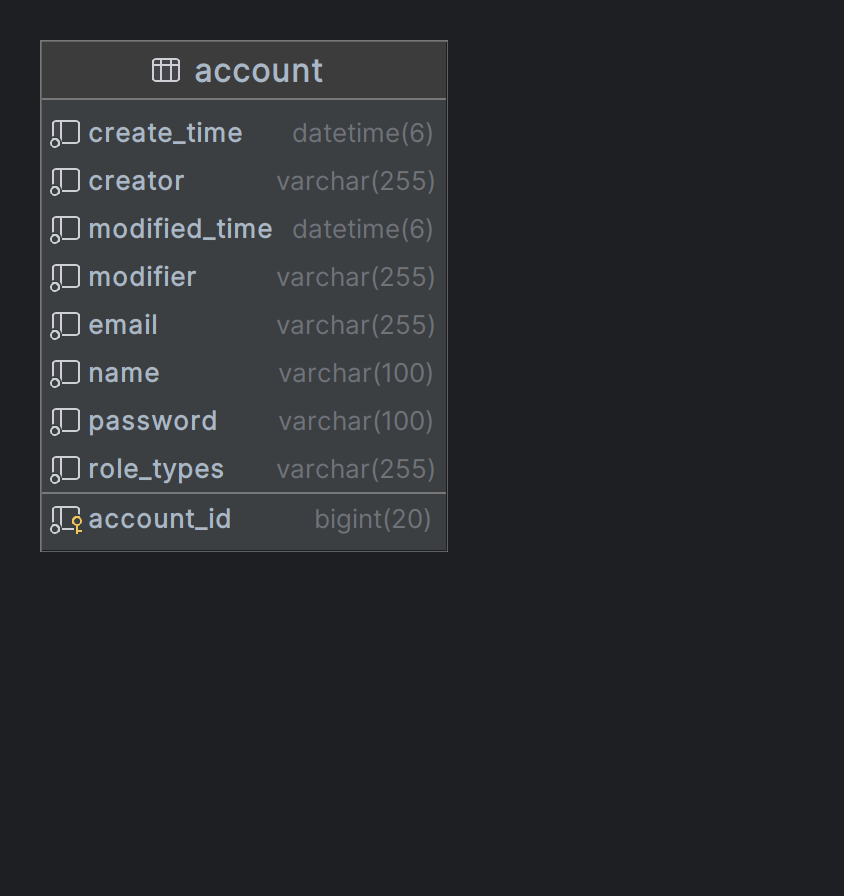

# Simple Board Admin

> 게시판 서비스 관리자 페이지

# 요구사항

- 관리자 계정, 방문자 수 집계
- 웹 화면 제공
- 기존 게시판 서비스와 API 통신
- 기타 부가 기능
- 인증 기능 (kakao oauth2)

# 실행 전 필요 환경 변수
- `SIMPLE_BOARD_URL` : 간단 게시판 base url
- `KAKAO_OAUTH2_LOGIN_KEY` : 카카오 로그인 관련 key
- `KAKAO_OAUTH2_LOGIN_SECRET` : 카카오 로그인 관련 secret
- `CLOUDTYPE_MARIA_DB_URL` : 연결할 mariaDB url
- `CLOUDTYPE_MARIA_DB_USERNAME` : 연결 DB 의 username
- `CLOUDTYPE_MARIA_DB_PASSWORD` : 연결 DB 의 password

# 도메인 설계

## 회원 도메인 (ACCOUNT)

[간단 게시판 프로젝트](https://github.com/GuardJo/simple-board-project)

[노션 링크](https://trapezoidal-curiosity-d38.notion.site/Simple-Board-Admin-2c2fdc67a582434d9985588044ca4d58)